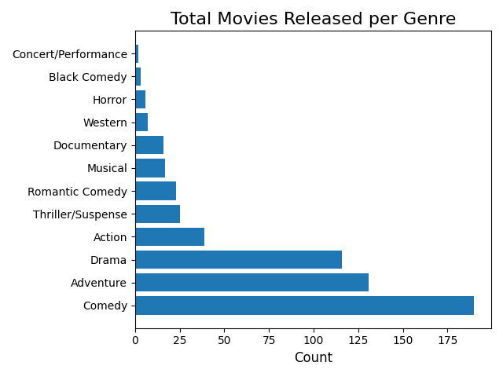

https://datacatalog.worldbank.org/public-licenses#cc-by
https://www.kaggle.com/burhanykiyakoglu/infant-mortality-fertility-income
https://www.kaggle.com/rashikrahmanpritom/disney-movies-19372016-total-gross/metadata

Introduction
  Organized and Detailed Summary of Milestones 1- 3
      Business Problem/Data
      Graphical Analysis
      Dimensionality & Feature Reduction and Feature Engineering
      Model Selection & Evaluation

Your case study report should be a minimum of 3-5 pages, along with visuals created to support your analysis.

# Introduction
Movie production is a long and expensive process that necessitates careful planning and extensive risk mitigation.  The factors that influence the opinion, interest, and motivation of movie-goers are as diverse as the people themselves, but there are some logical hypotheses that we can make.  For example, many leisure activities are influenced by the weather.  Indoor activities may become more popular as the weather becomes less agreeable, or perhaps less popular due to generally lower motivation to leave home.  

It also seems reasonable to assume that the overall health and prosperity of a society could influence the desire and ability to pursue leisure activities.  Unemployment rates, for example, could logically be expected to impact the availability of disposable income. influence the popularity of leisure activities such as visiting the theater.  Fertility and mortality rates are recognized as general measures of societal health and development, which may well influence public interests.  Disney movies in particular have the connotation of being family-oriented, so it stands to reason that fertility rate could impact the target audience of these films.

The objective of this analysis is to help mitigate the risks involved in investing in film production by providing insight into factors that can impact the total profits earned from those investments.

# Process Summary

## Milestones One & Two: Data Exploration, Visual Analysis, and Feature Engineering.
The goal of this analysis was to predict the total gross profits of a Disney movie based on aspects of the movie itself and/or broader social indicators.  The Disney movie dataset included some potentially useful information about the movies themselves, while information regarding societal development indicators provided broader information about health and society in the United States.

The primary dataset provides information about movies produced by Disney, with historical data back to about 1940.  Features of interest included the date of release, genre, and inflation adjusted total gross profits, which represents the target feature for this analysis.

This dataset was fairly well organized and complete, with less than 10 missing values in most of the features.  The only exception was the MPAA Rating feature (G, PG, R, etc.).  This feature had to be discarded due to the large number of missing values and the lack of a conceptually appropriate fill method.  

New features were created to represent the month and year of release, which were then one-hot encoded to create a feature for each month of release.  The genre feature was also one-hot encoded, and all features were aggregated by sum to create yearly totals.  The finished dataset contained one feature for each movie release month, one feature for each genre, and one feature for the adjusted total gross profits, with the row index representing the year.

The second dataset provided societal development indicators by country and year, including fertility rate, mortality rate, and per capita income.  This dataset was oddly organized, with only one row per country and columns for each year-indicator combination.  The dataset was reorganized to match the desired format, with the row index representing the year and one feature for each of the three indicators.  The data appeared otherwise sound and complete, but was lacking any data for years prior to 1970.

These two datasets were joined by year to create a dataset with yearly observations for all features.  While the movie dataset did contain observations for years prior to 1970, they represented a very small proportion of the total observations.  Therefore, observations before 1970 were dropped, and the dataset ultimately spanned from 1970 to 2016, with a few observations missing from the 1970s.  The finished dataset contained 29 features, including the target feature, and 42 observations.  The target feature was then separated from the predictive features.

Finally, feature reduction was performed on the predictive dataset to prune unnecessary or deleterious features and improve model performance.  An iterative modeling process was employed to determine the ideal number of features to keep, and the best features were identified using a univariate linear regression and F-statistic based testing method.  This resulted in a reduction from 28 to 16 predictive features and significantly improved linear regression scores.  The reduced feature dataset contained features representing:
- Movie releases in the months of January, February, March, April, May, June, August, October, and December.
- Movies in the genres of action, adventure, comedy, drama, and thriller/suspense.
- Mortality rate and per capita income.

## Milestone Three & Four: Model Selection, Creation, and Evaluation.
The first step of the model creation process was to split both datasets into training and testing sets.  The training

# Conclusion

Conclusion (Findings, Summarization)
At a minimum make sure that you answer the following questions:
What does the analysis/model building tell you?
What are your recommendations?
How would you pitch this business problem to a group of stakeholders to gain buy-in to proceed?
Why should someone in the business care about this solution?
What are some of the potential challenges or additional opportunities that need to be explored?
